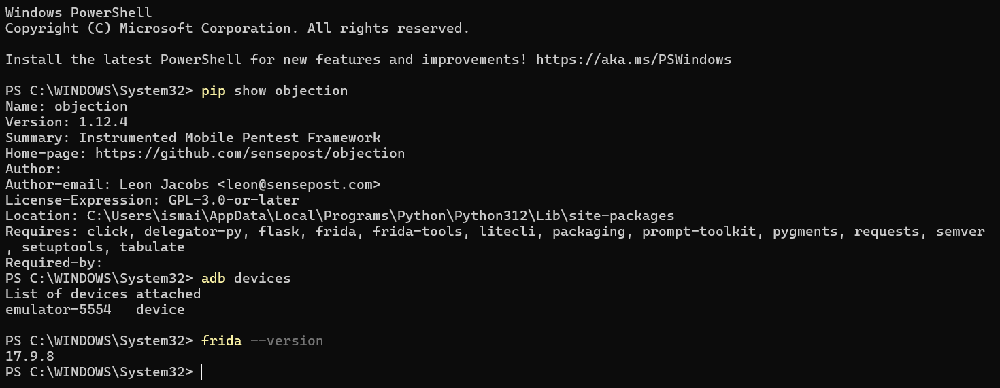
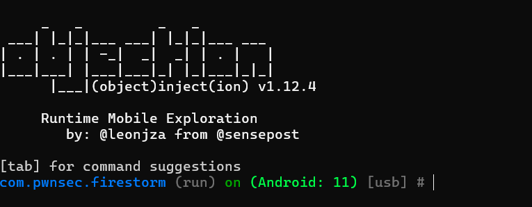
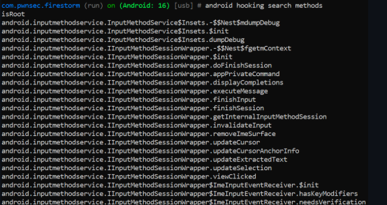
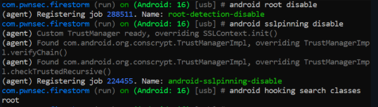

# LAB 13 — Bypass de la Détection de Root Android avec Objection

| Titre | Bypass de la Détection de Root Android avec Objection |
|-------|------------------------------------------------------|
| **Nom** | Ismaïl |
| **Date** | 19 Mai 2026 |
| **Module** | Sécurité Mobile / Pentest Android |

---

## Objectif

Contourner la détection de root d'une application Android en utilisant **Objection** (basé sur **Frida**) pour injecter des hooks Java et masquer l'état rooté de l'appareil.
App cible : `com.pwnsec.firestorm` sur émulateur Android.

---

## Environnement

| Outil | Version / Détail |
|-------|-----------------|
| OS | Windows 11 |
| Émulateur | Pixel 5 — Android 11 |
| Frida | 17.9.8 |
| Objection | 1.12.4 |
| Shell | PowerShell |

---

## Réalisation

### Étape 1 — Installation et vérification des outils

```powershell
pip install --upgrade objection
pip show objection
frida --version
adb devices
```

Objection 1.12.4, Frida 17.9.8 installés. L'émulateur `emulator-5554` est détecté.



---

### Étape 2 — Connexion Objection à l'app

```powershell
objection -g com.pwnsec.firestorm explore
```

L'agent Frida est injecté et l'invite interactive s'affiche :
`com.pwnsec.firestorm (run) on (Android: 11) [usb] #`



---

### Étape 3 — Exploration des méthodes root

```
android hooking search methods isRoot
```

Objection liste toutes les méthodes `isRoot` présentes dans le runtime, confirmant la présence de checks root dans l'app.



---

### Étape 4 — Bypass root + SSL Pinning

```
android root disable
android sslpinning disable
android hooking search classes root
```

Objection installe des hooks qui :
- Retournent `false` pour `File.exists()` sur les chemins suspects (`/system/xbin/su`, etc.)
- Forcent `Build.TAGS` à `release-keys`
- Bloquent `Runtime.exec()` pour les commandes `su`

Jobs enregistrés : `root-detection-disable` ✅ — `android-sslpinning-disable` ✅



---

## Résultats

| Exercice | Résultat |
|----------|----------|
| Installation Objection + Frida | ✅ Versions vérifiées |
| Connexion via Objection | ✅ Invite interactive obtenue |
| Exploration méthodes root | ✅ `isRoot` trouvé dans le runtime |
| Bypass root detection | ✅ Job `root-detection-disable` actif |
| Désactivation SSL Pinning | ✅ Job `android-sslpinning-disable` actif |

---

## Conclusion

Ce TP montre qu'il est possible de contourner la détection root côté Java en quelques commandes avec Objection. Les hooks Frida modifient le comportement de l'app en temps réel sans modifier l'APK. Une protection efficace doit combiner des checks natifs (C/C++) et une détection anti-instrumentation.

---

## Structure du projet

```
Lab13/
├── README.md
├── bypass_native.js
└── screenshots/
    ├── etape1_versions.png
    ├── etape2_objection_prompt.png
    ├── etape3_hooking_search_isroot.png
    └── etape3_root_disable_sslpinning.png
```
